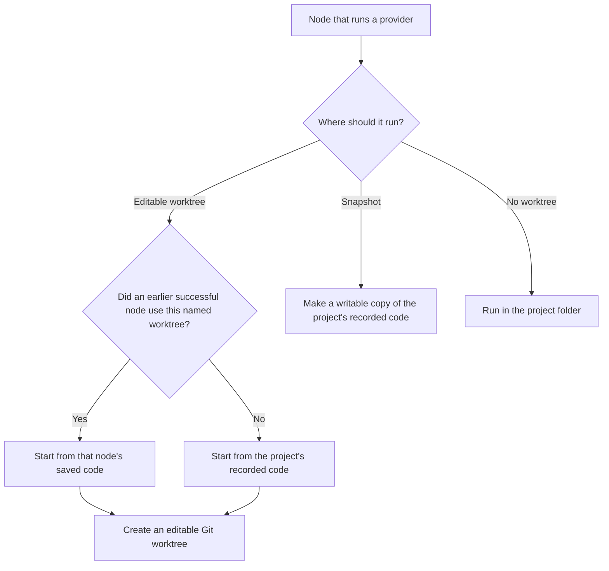
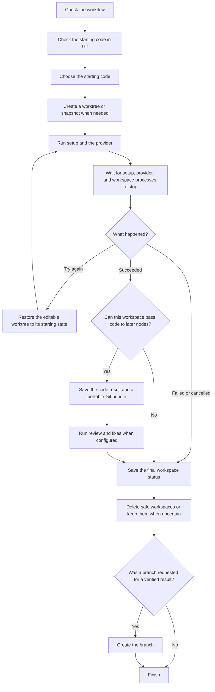
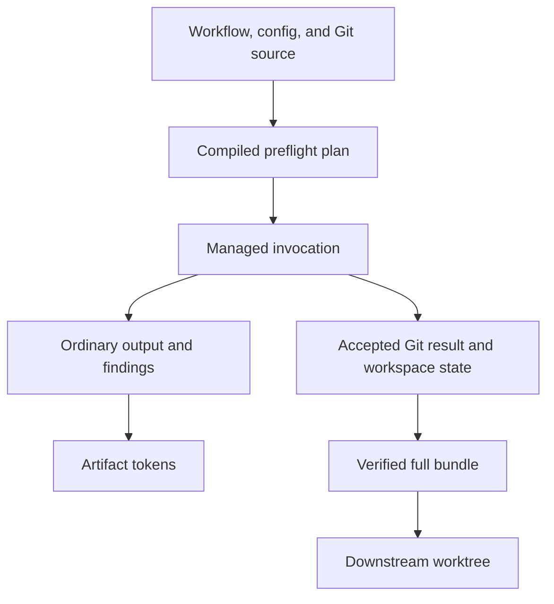

# Workspace Isolation Architecture

## Workspace Model

A **logical worktree** is a named source line declared by the workflow. Nodes
that select the same mutable logical worktree continue the same line of code.
Nodes that select different names use independent source lines.

There are three execution choices:

| Choice | Provider directory | Can produce downstream code lineage? | Typical use |
| --- | --- | --- | --- |
| `kind: worktree` | Mutable detached Git worktree | Yes | Implement or remediate code |
| `kind: snapshot` | Writable directory without `.git` metadata | No | Inspect, test, or write disposable scratch files |
| `worktree: none` | Project root | No managed lineage | Explicitly use normal project-root execution |



**Code lineage** means the exact Git commit and tree that a later mutable node
inherits. Ordinary node output and findings move through artifact references.
Source files do not move through those text references implicitly.

For example:

```yaml
worktrees:
  implementation:
    kind: worktree
  audit:
    kind: snapshot

nodes:
  - id: implement
    providers: [codex]
    worktree: implementation

  - id: inspect
    needs: [implement]
    providers: [claude]
    worktree: audit

  - id: fix
    needs: [implement, inspect]
    providers: [codex]
    worktree: implementation
```

`fix` continues the code produced by `implement` because both select
`implementation` and the DAG orders them. `inspect` can produce findings, but
its snapshot changes are discarded and are not merged into `fix`.

### Git Terms Used in This Document

| Term | Plain-language meaning |
| --- | --- |
| Commit | A Git object that records a project tree and its parent history. |
| Tree | Git's exact directory and file structure for a commit. |
| Object ID (OID) | The hash Git uses to identify a commit, tree, or file blob. |
| Detached `HEAD` | A checkout pointing directly at a commit instead of a branch. Resetting it cannot move a user branch. |
| Ref | A named Git pointer, such as a branch or a runtime-owned result pointer. |
| Compare-and-swap | Change a ref only if its current value still matches the value previously observed. |
| Bundle | A Git file containing the objects and ref needed to transfer a result. |

## Core Guarantees

The implementation is designed around these guarantees:

1. **Artifacts are durable truth.** Live checkout and cache directories are
   temporary materializations. Workspace state, manifests, and bundles under
   `.crewplane/` are the durable run evidence.
2. **One active owner per checkout.** Setup, a provider call, retry reset,
   result capture, reuse handoff, and cleanup must not mutate the same physical
   checkout at the same time.
3. **Source is explicit.** Every managed invocation starts from a recorded
   commit and tree. A node result can be consumed only after its full recorded
   source chain has been verified.
4. **Destructive Git work starts detached.** Reset, cleaning, reuse, and
   disposal must prove that `HEAD` is detached or preserve any attached branch
   before continuing.
5. **Processes stop before source transitions.** The runtime must drain the
   provider or setup process, its process group, output pipes, and runtime-owned
   workspace workers before capture, reset, reuse, or cleanup.
6. **The runtime owns accepted results.** Providers leave file changes in the
   checkout. The runtime stages the accepted filesystem state in a private
   index, validates it, and creates the lineage commit itself.
7. **Ref changes are scoped and atomic.** One invocation protects only the refs
   it consumes or owns. Candidate and result refs are published together with
   compare-and-swap checks.
8. **State is written before destruction.** A terminal workspace record exists
   before a checkout is removed or returned for reuse.
9. **Uncertainty retains data.** If the runtime cannot prove process liveness,
   checkout ownership, repository identity, ref ownership, or safe cleanup, it
   keeps the affected path or ref and records why.
10. **Disabled mode remains independent.** A workflow that does not use managed
    workspaces keeps project-root behavior and does not pay workspace or Git
    validation costs.

## Components and Boundaries

Workspace isolation crosses several existing architecture boundaries. It is a
runtime service, not a provider-specific feature and not a replaceable adapter.

| Boundary | Responsibility | Main code |
| --- | --- | --- |
| Config and workflow model | Define workspace settings, logical worktree declarations, and node selectors. | `src/crewplane/core/workspace/`, `src/crewplane/core/workflow/` |
| Workflow validation and composition | Validate source-line ordering, inheritance, imports, snapshots, and project-root opt-out. | `src/crewplane/core/workflow/validation/`, `src/crewplane/core/workflow/composition/` |
| Preflight compilation | Turn authored policy and file tokens into a deterministic execution plan. | `src/crewplane/core/preflight/` |
| CLI source gate | Discover the repository, apply clean-start and Git policy, check capacity, and collect source identity before a real run. | `src/crewplane/cli/run/workspace/` |
| Runtime workspace service | Materialize snapshots and worktrees, select invocation sources, run setup, capture results, reuse checkouts, and write terminal state. | `src/crewplane/runtime/workspace/` |
| Process lifecycle | Launch providers with explicit `cwd`, apply the controlled child environment, and drain process groups with finite deadlines. | `src/crewplane/runtime/agent/` |
| Artifact validation | Validate workspace state, file descriptors, bundle contents, and complete source chains for skip and resume. | `src/crewplane/artifacts/workspace/` |
| Run orchestration | Connect preflight, runtime execution, branch export, summaries, and final run status. | `src/crewplane/cli/run/`, `src/crewplane/runtime/execution/` |
| Cleanup command | Find and remove only workspaces and refs supported by exact project evidence. | `src/crewplane/cli/cleanup.py`, `src/crewplane/cli/workspace_cleanup/`, `src/crewplane/runtime/workspace/cleanup.py` |
| Invoker adapter | Declare whether the invoker honors `cwd` and uses the controlled process-launch path. It does not own workspace policy. | `src/crewplane/architecture/ports/`, `src/crewplane/adapters/invokers/` |

The UI remains an observer. It can display workspace state but cannot choose a
source, approve lineage, mutate refs, or change cleanup decisions.

## Authored Model and Selection Rules

Project config controls whether the feature is available. Workflow files own
the logical source-line shape.

Important settings are:

- `settings.workspace.enabled`: opt-in gate; defaults to `false`.
- `cache_root`: location for temporary materialized checkouts.
- `cleanup_on_success`: whether successful live checkouts should be removed.
- `worktree_contract`: currently only `blob_exact`.
- `clean_start`: either `strict` or `tracked_only`.
- `setup_profiles`: audited argument-list commands for mutable worktrees.
- `max_concurrent_materializations`: in-process materialization limit.
- `disk.warn_free_bytes` and `disk.fail_free_bytes`: capacity guardrails.

The [configuration reference](../reference/configuration.md) owns the complete
field list and defaults. The models in
`src/crewplane/core/workspace/settings.py` own exact validation.

Workflow selection follows these rules:

- A workflow with one declared worktree lets provider nodes inherit it unless a
  node sets `worktree: none`.
- A workflow with multiple declarations requires each provider node to select
  one or explicitly choose `none`.
- Input nodes never allocate provider workspaces and cannot select a worktree.
- Mutable nodes on the same logical worktree must be ordered by the DAG. Two
  unordered writers cannot silently fork and merge one source line.
- A mutable node inherits the latest ordered successful ancestor that selected
  the same logical worktree name.
- Different logical worktree names never merge source automatically. They can
  still exchange ordinary outputs and findings.
- A mutable node has one executor in the current model. Reviewers receive
  separate disposable worktrees and cannot advance lineage.
- Snapshots always start from the recorded project source and never inherit an
  upstream mutable result as code.

## Execution Lifecycle

The lifecycle below describes a real run with workspace isolation enabled.
Validation and dry-run stop before allocation and mutation.



### 1. Compile and Validate the Workflow

Core parses and composes the workflow before runtime begins. It validates
logical worktree names, node selectors, DAG ordering, imports, setup profiles,
branch options, and mutable-source inheritance.

Preflight compiles this information into a `PreflightExecutionPlan`. Runtime
consumes that plan. It does not re-read the workflow or parse prompt tokens
again.

### 2. Prove the Project Source

The CLI source gate runs before provider cost and before run allocation. It:

1. Confirms the selected invoker can honor the workspace launch contract.
2. Discovers the Git top level, active Git directory, common Git directory,
   object format, base commit, and base tree.
3. Applies the configured clean-start rule.
4. Rejects unsupported repository, index, attribute, filter, config, object
   store, submodule, path-alias, and filesystem states.
5. Compiles repo-relative `{{file:...}}` inputs from exact Git blob bytes.
6. Validates cache placement and estimates checkout capacity.
7. Includes the relevant source and policy facts in the workflow signature so
   different inputs cannot be mistaken for the same execution.

`crewplane validate` and `crewplane run --dry-run` may perform read-only Git
queries, but they do not create a run directory, worktree, bundle, ref, cache
child, or workspace-state file.

### 3. Choose the Invocation Source

The compiled plan determines the source for each invocation:

| Invocation | Source |
| --- | --- |
| First mutable node on a logical worktree | Recorded project base commit and tree |
| Later mutable node on the same logical worktree | Latest verified result from the ordered same-name ancestor |
| Snapshot executor | Recorded project base commit and tree |
| Reviewer for a mutable candidate | Current runtime-owned candidate commit and tree |
| Remediation executor | Current candidate commit and tree |
| `worktree: none` | Project root, outside managed lineage |

Before consuming a prior node result, the runtime verifies the complete ordered
source chain rather than trusting objects that happen to exist in the project
repository.

### 4. Materialize the Workspace

A snapshot is created with a private temporary Git index and checked out into
an owner-private directory without `.git` metadata. Providers may write there,
but the runtime discards those writes after reporting drift.

A mutable workspace is created as a detached, locked Git worktree. The
workspace service records repository identity, physical placement, source
identity, and reuse generation before invoking a provider.

Live materializations are stored outside both the project checkout and its
`.crewplane/` directory. The default cache root is
`~/Library/Caches/crewplane` on macOS and
`${XDG_CACHE_HOME:-~/.cache}/crewplane` on Linux and WSL. Within that root, the
cache separates mutable `workspaces/`, disposable `snapshots/`, and
`review-workspaces/` by repository and run. Temporary Git indexes use
owner-private system temporary directories instead of the persistent cache.

Ordered nodes on the same logical source line may reuse one physical checkout.
Reuse is allowed only after the previous boundary is durable, ownership is
exclusive, the next generation is recorded, and reset verifies the exact
source. If safe reuse cannot be proved, the runtime uses a distinct fresh path.

Immediately before each fresh materialization, the runtime rechecks available
capacity inside the materialization limiter. Concurrent in-process admissions
reserve their estimated bytes so they cannot spend the same free space.

### 5. Run Setup and the Provider

Setup profiles run only for selected mutable worktrees. Each command is an
argument list, not a shell string. Output and status are recorded under the node
stage directory.

Provider calls receive an explicit `cwd` and an `InvocationContext` describing
the selected source and workspace. Process-based providers must launch through
the command runner so the child process receives the controlled Git
environment.

Workspace provisioning copies tracked repository source, not ambient local
state. Ignored dependency directories, virtual environments, build products,
and untracked files are not copied from the user's checkout. Setup or the
provider may recreate them inside the managed workspace, but ignored untracked
files are not lineage.

### 6. Resolve File Tokens for the Actual Invocation

When workspace isolation is enabled, repo-relative `{{file:path}}` values come
from a Git blob in the invocation's selected commit and tree. Runtime does not
read those bytes from a mutable checkout.

This keeps prompt content aligned with the code being inspected:

- an initial executor reads from its source commit;
- a reviewer reads from the current candidate;
- a remediation round reads from the candidate it will modify; and
- a downstream executor reads from the verified upstream result.

Each resolved file records its path, Git blob, size, mode, digest, source
commit, and invocation identity. Symlinks, trees, gitlinks, missing files,
non-UTF-8 text, NUL bytes, ambiguous paths, and non-literal Git path matches are
rejected.

Allowlisted absolute paths remain external static preflight resources. They are
not copied into Git lineage.

### 7. Handle Retry, Cancellation, and Process Drain

A provider transport retry is not a new source lineage step. Before retrying a
mutable invocation, the runtime:

1. Finishes a bounded leader, process-group, and pipe drain.
2. Stops if liveness remains uncertain.
3. Proves the checkout is detached without moving an attached branch.
4. Resets tracked, untracked, ignored, staged, and worktree-config changes to
   the recorded attempt baseline.
5. Verifies the clean source and `blob_exact` contract again.

Cancellation uses the same finite drain rules. It stops new scheduling, records
unresolved workers or processes, writes terminal cancellation state, and then
attempts evidence-based cleanup. An unresolved process fences reset, capture,
reuse, and deletion.

### 8. Capture and Publish a Mutable Result

After a successful mutable executor invocation, the runtime does not trust a
provider-created commit. It:

1. Confirms all relevant processes and workers are drained.
2. Proves `HEAD` is still detached at the expected commit.
3. Rechecks repository policy and only the refs owned or consumed by this
   invocation.
4. Loads the recorded parent into a private runtime index.
5. Stages accepted tracked changes, deletions, modes, symlinks, and untracked
   non-ignored files from the final checkout.
6. Excludes newly ignored files, even if the provider added them to its own
   index.
7. Validates every result path, object, mode, policy file, and `blob_exact`
   byte contract.
8. Creates deterministic runtime-owned candidate and result commits.
9. Derives changed-path reporting from the accepted result tree.
10. Records publication intent, then publishes candidate and result refs in one
    compare-and-swap transaction.
11. Creates and verifies a full self-contained Git bundle from the result ref.

If any step fails, the node produces no downstream lineage. Provider output may
remain as failure evidence, but it is not an accepted source result.

### 9. Review and Remediate Candidates

Reviewers never share the executor's live mutable checkout. Each reviewer gets
a separate disposable worktree rooted at the current candidate commit.

Reviewer writes, `HEAD` movement, and worktree config changes are reported and
discarded. Reviewer output and findings can guide a remediation round, but only
the executor can produce the next candidate. The remediation executor resumes
from the current candidate and is captured again through the same runtime-owned
result path.

### 10. Write Terminal State Before Cleanup

The runtime writes `succeeded`, `failed`, or `cancelled` together with
retention intent before deleting a workspace or returning it for reuse.

Cleanup then works from exact recorded evidence:

1. Reconcile candidate and result refs by their recorded target OIDs.
2. Reconcile invocation-owned temporary import refs by exact name and target.
3. Verify the worktree registration, `.git` backlink, common Git directory,
   physical path, generation claims, process state, and detached `HEAD`.
4. Remove registered worktrees through `git worktree remove --force`.
5. Remove snapshots, reviewer workspaces, and genuine no-claim orphan paths.
6. Change only the retention projection to `deleted` or `retained`; never
   rewrite the terminal outcome.

Moved refs, ambiguous generations, malformed evidence, uncertain liveness,
unexpected symlinks, repository mismatches, and unsafe branch state are
retained for diagnosis.

### 11. Fulfill Optional Branch Export

Branch export is a separate, auditable operation after result verification. It
does not push, merge, rebase, open a pull request, or switch the user's checkout.

Before changing a local branch ref, the runtime writes a prepared fulfillment
record containing the branch name, expected old value, target commit, run
identity, and recovery mode. It then verifies the complete source chain and
updates the branch with compare-and-swap under the Git metadata lock.

A matching completed record is idempotent. An unexpected existing branch value
is a collision and is never overwritten.

## Durable State and Artifact Flow

Ordinary orchestration artifacts and source lineage remain separate.



### Workspace State

Every managed provider workspace writes `workspace-state*.json` under its node
stage directory. Input nodes and `worktree: none` nodes do not create managed
workspace state.

The state groups evidence by purpose:

| Evidence | Why it is recorded |
| --- | --- |
| Run and invocation identity | Prevent one node, provider, round, or run from consuming another's state. |
| Repository and policy identity | Prove the same repository, object format, source, and contract are in use. |
| Source and invocation source | Identify the exact project, upstream result, or candidate being inspected. |
| Physical placement and generation | Prove who owns a reusable checkout path. |
| Process drain and mutator state | Fence destructive transitions while work may still be active. |
| Rendered file descriptors | Prove which Git blob bytes reached each prompt or input. |
| Result and bundle | Identify the accepted commit, tree, changed paths, and portable source artifact. |
| Ref publication and temporary refs | Make creation and cleanup recoverable after interruption. |
| Terminal status and retention | Separate execution outcome from later cleanup outcome. |

Persisted readers validate the complete group of facts needed for their
operation. A matching schema version alone does not make incomplete or
contradictory state safe to reuse.

### Full Result Bundles

Each successful lineage-producing node result creates a full Git bundle whose
single offered tip is the durable result ref. The bundle is self-contained; it
does not rely on prerequisite bundles or ambient project objects.

Every consumer uses the same ordered chain verifier. The verifier:

1. Checks artifact containment, size, digest, object format, and descriptor
   identity.
2. Creates an isolated bare Git repository.
3. Seeds only the recorded project base.
4. Verifies each source descriptor and bundle in order.
5. Confirms the offered ref, result commit, parent, and tree.
6. Imports a missing verified result into the project repository only through
   a unique invocation-owned temporary ref.
7. Removes that temporary ref by its exact recorded OID when the consumer is
   finished.

Materialization, managed-file rendering, duplicate skip, resume, branch export,
and checkpoint validation all use this verifier.

### Duplicate Skip, Resume, and `--force`

Duplicate skip can reuse a successful same-context run only when ordinary
artifacts, workspace state, source descriptors, rendered file descriptors,
result identity, and complete bundle chains all validate. It does not require a
live cache directory.

Resume starts a fresh run. It may hydrate verified node-boundary artifacts and
lineage into the new run layout, but it never treats an old live checkout or
cached ref as source truth. Invalid lineage moves the resume boundary back to
the earliest safe node.

`--force` bypasses successful duplicate skip and failed or cancelled resume. It
creates new execution evidence, refs, and fresh fallback paths. It does not use
an earlier result as an implicit source.

## Concurrency, Reuse, and Locks

There are two different kinds of concurrency:

- Provider invocations on different logical worktrees can run concurrently.
- Git metadata changes in one repository are serialized.

The runtime combines an in-process asynchronous lock with a POSIX advisory lock
under the repository's common Git directory. The lock covers worktree
administration, bundle import and export, runtime-owned Git object writes, ref
transactions, and cleanup.

The lock coordinates cooperating runtime processes. It cannot stop a user,
IDE, hook, or provider from running Git commands. For that reason, runtime
rechecks the exact identities it relies on after lock-protected operations.

A reused checkout carries a positive generation number. Each exclusive claim
increments the generation before reset. All persisted claims for one normalized
physical path must form a coherent history before cleanup can remove it.

Refs follow the same ownership rule. Runtime does not snapshot or police the
whole `refs/crewplane` namespace. Each invocation records only its consumed,
candidate, result, import, and export destinations. Independent runs therefore
do not fail merely because an unrelated runtime-owned ref changes.

## Failure and Retention Behavior

Workspace isolation fails closed: it stops before accepting or destroying state
when required evidence is missing or contradictory.

| Condition | Run behavior | Workspace or ref behavior |
| --- | --- | --- |
| Invalid workflow, source policy, or unsupported repository | Fail before provider execution. | Allocate nothing. |
| Persisted state or source-chain mismatch | Fail before consuming the result. | Remove only a newly created path whose identity is proven; otherwise retain. |
| Provider attaches `HEAD` to a branch or moves it | Fail the mutable result; do not advance lineage. | Preserve the branch OID, detach only for safe disposal, and retain if preservation is uncertain. |
| Setup or provider process group cannot be drained | Fail or cancel with liveness evidence. | Do not reset, capture, reuse, or remove the checkout. |
| Candidate/result ref collision | Fail finalization without overwriting the ref. | Clean only exact still-owned refs and paths. |
| Result bundle or chain verification fails | Reject skip, resume, materialization, or export. | Keep canonical evidence for diagnosis. |
| Safe reuse cannot be proved | Record a fallback diagnostic. | Dispose of or retain the old checkout from exact evidence and use a distinct fresh path when safe. |
| Snapshot reporting reaches its reporting budget | Keep a successful disposable invocation if the scan itself remained safe. | Record drift as unknown and remove or retain according to normal cleanup policy. |
| Capacity is below a configured failure threshold | Fail before fresh materialization. | Do not create the checkout. |
| Cleanup ownership or liveness is ambiguous | Preserve the terminal run outcome. | Retain the path or ref and record the reason. |

Failure and cleanup are separate facts. A node can succeed and later retain a
checkout because cleanup was unsafe. A node can fail and still have useful logs
and state. Cleanup must never rewrite the execution outcome.

## Trust Boundary and Git Contract

The current workspace contract is `blob_exact`. It means provider-visible
tracked file bytes and accepted result bytes must match Git blob bytes without
machine-specific conversion.

To enforce this contract, runtime-owned Git commands use explicit repository
paths, literal path handling, sanitized environment variables, bounded config
overrides, and Git plumbing commands. The source gate rejects repository
features that can change bytes or hide source state outside that contract.

The current managed-workspace envelope excludes:

- Git LFS and custom clean or smudge filters;
- text, end-of-line, `ident`, or working-tree encoding conversion;
- submodules, sparse checkout, shallow and partial clones;
- object alternates, grafts, and replacement behavior;
- unsupported local or worktree Git config and attribute sources;
- split index, fsmonitor, untracked cache, and hidden index flags;
- unsafe case-folding or Unicode path aliases;
- native Windows execution; use WSL or another POSIX environment; and
- provider-created commits as lineage.

Workspace-enabled execution requires Git 2.34.1 or newer plus successful probes
for the exact Git operations used here. Capability probes are authoritative;
the version number alone is not enough.

Workspace isolation does not prevent a provider from intentionally modifying
user refs, Git configuration, hooks, the shared object database, or files
outside the workspace when its permissions allow that access. Runtime rejects
observable changes that break its own result contract, but stronger process and
repository isolation would require a clone, container, virtual machine, or
provider-owned sandbox boundary.

Provider-created unreachable Git objects may remain in the shared object
database until normal Git maintenance removes them. The runtime never uses
those objects as lineage.

## Capacity and Performance

Git worktrees share the repository object database, but every mutable worktree,
snapshot, and reviewer view still materializes source files. Large repositories
can therefore use significant disk space and checkout time.

Preflight estimates source checkout cost. Runtime repeats the capacity check at
the last safe boundary before every fresh materialization. Configured warning
and failure thresholds determine whether low space produces a warning or a
hard failure.

The estimate covers repository source, not arbitrary provider behavior. Setup
commands and providers may create dependency caches or build outputs that are
larger than the estimate. Those files are execution conveniences and are not
canonical lineage when Git treats them as ignored untracked files.

Current execution deliberately favors complete materialization and strict
verification over sparse, lazy, filtered, or provider-specific checkout paths.

## Operational Visibility

Start diagnosis under:

```text
.crewplane/execution-stages/<run-key>/
.crewplane/execution-results/<run-key>/
```

Useful evidence includes:

- preflight diagnostics and the compiled execution plan;
- `workspace-state*.json` for source, invocation, process, generation, result,
  ref, and retention facts;
- `workspace-bundles/*.bundle` for portable lineage;
- node and run manifests;
- provider and setup logs;
- branch-export fulfillment records; and
- run events and summaries.

Live cache paths are execution details and may already be deleted. When they
are retained, the state record explains their physical path and retention
reason. Do not infer successful lineage from a surviving checkout.

Use the [artifact reference](../reference/artifacts.md) for the durable layout,
the [workspace guide](../guides/workspace-isolation.md) for normal usage, and
the [cleanup guide](../guides/cleanup.md) before removing retained workspaces.

## Changing the Architecture Safely

When a change crosses this subsystem:

1. Identify whether it changes the authored workflow/config contract, internal
   lifecycle only, durable artifact shape, or security boundary.
2. Keep provider-specific transport in invoker adapters and workspace policy in
   core, preflight, or runtime workspace modules.
3. Update the compiled plan before adding runtime inference from authored
   workflow text.
4. Preserve disabled project-root execution unless the public contract
   explicitly changes.
5. Add deterministic tests for the affected success, invalid-input, failure,
   retry, cancellation, concurrency, cleanup, and resume paths.
6. Update public references when syntax, configuration, defaults, diagnostics,
   artifact layout, or supported repository behavior changes.
7. Update this document when a boundary, lifecycle stage, invariant, or trust
   boundary changes.
8. Record a new or superseding ADR for a consequential architecture decision;
   do not rewrite ADR 0016 as current implementation documentation.

Use the repository's normal validation targets from `DEVELOPMENT.md`. Run
focused tests for the affected boundary first, then run the full quality gate
when the implementation changes across boundaries.

## Key Decisions and Limitations

The current architecture intentionally does not:

- merge or rebase different logical source lines;
- push branches or create pull requests;
- treat snapshot changes as code lineage;
- preserve provider-created commits as accepted history;
- copy ambient ignored or untracked project state into managed workspaces;
- support non-filesystem artifact backends for real managed execution;
- support native Windows, submodules, Git LFS, filters, partial clones, or
  sparse checkouts in the `blob_exact` contract; or
- provide operating-system sandboxing.

These are supported-envelope boundaries, not missing recovery paths. Adding one
requires a present use case, an explicit contract, deterministic failure
behavior, and tests. A change that alters the basic source-line model, trust
boundary, artifact compatibility, or adapter boundary requires a new ADR.

## References

- [Modular orchestration architecture](modular-orchestration-architecture.md)
- [ADR 0001: Ports and adapters](adr/0001-ports-adapters-runtime-integrations.md)
- [ADR 0012: Preflight-compiled runtime plan](adr/0012-preflight-compiled-runtime-execution-plan.md)
- [ADR 0014: Artifact-backed node-boundary resume](adr/0014-artifact-backed-node-boundary-resume.md)
- [ADR 0016: Node-scoped Git workspace isolation](adr/0016-node-scoped-git-workspace-isolation.md)
- [Workspace isolation user guide](../guides/workspace-isolation.md)
- [Configuration reference](../reference/configuration.md)
- [Workflow syntax reference](../reference/workflow-syntax.md)
- [Artifact reference](../reference/artifacts.md)
- [Cleanup guide](../guides/cleanup.md)
