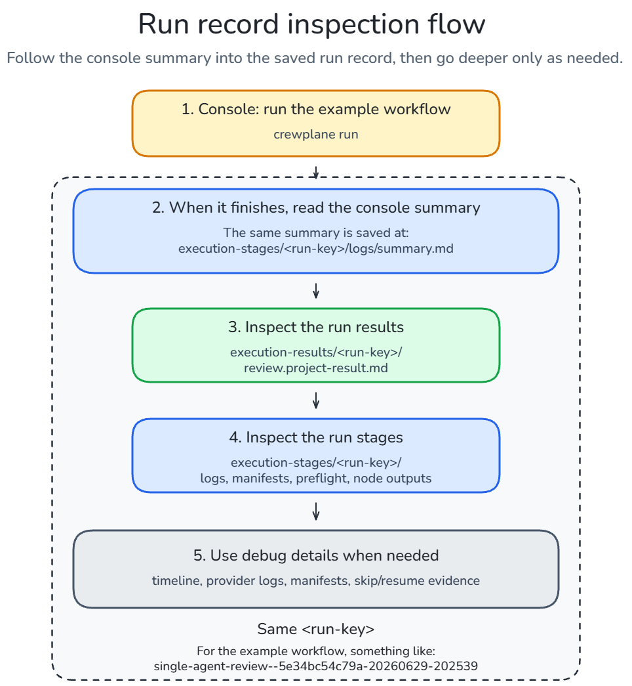

# Quickstart: See The Control Plane

Use this walkthrough after [installing Crewplane](installation.md). You will
create a local `.crewplane/` directory, validate the generated workflow, run
the workflow, and inspect the run record Crewplane writes to disk.

In a fresh project, the generated `.crewplane/config.yml` selects the mock
invoker. With that config, `crewplane run` does not require a model call,
provider CLI startup, credentials, API keys, provider account access, token
spend, or config edits. `tmux` is optional; when it is missing, Crewplane warns
and continues without the live dashboard.

Start in the project where you want Crewplane to create local workflow files
and run records:

```bash
crewplane init
crewplane validate
crewplane run
```

These commands initialize the project, validate the selected workflow, and run
the workflow selected by `.crewplane/config.yml`. In a fresh project, the
generated config selects the mock invoker.

## 1. Initialize The Project

```bash
crewplane init
```

`crewplane init` creates Crewplane's local working area. In a fresh project, the
command creates:

- `.crewplane/config.yml`: the project configuration file, including provider
  settings and other parameters
- `.crewplane/workflows/`: your workflow definitions, preloaded with example
  workflows
- `.crewplane/workflows/single-agent-review.task.md`: the example single-agent
  workflow used during the quickstart
- `.crewplane/preflight/fingerprint.key`: the fingerprint key used for
  idempotency during resume and rerun

Only one `.task.md` file is created directly in `.crewplane/workflows/`, so the
next `crewplane validate` and `crewplane run` commands inspect and execute that
workflow by default. The additional examples live under
`.crewplane/workflows/example-templates/` and are not selected automatically.

Initialization stops before provider setup. It does not install provider CLIs
or authenticate provider accounts. `crewplane init` does not overwrite, which
means that running it again will create missing generated files and leave
existing files unchanged.

## 2. Validate The Workflow

```bash
crewplane validate
```

Before Crewplane runs anything, ask it to compile the workflow. Validation
parses and composes the default Markdown workflow, checks its schema, nodes,
dependencies, providers, and policies, then builds a preflight execution-plan
preview.

This is still a dry structural check. It does not invoke providers, write run
artifacts, or check provider CLI availability when you are using the generated
mock config.

The command should end with output like this:

```text
Preflight: compiled execution plan preview
Valid: 1 nodes across 1 execution wave(s)
```

## 3. Run The Mock Workflow

```bash
crewplane run
```

Now run the generated workflow. The default config uses Crewplane's mock
invoker, so the workflow executes with deterministic output instead of provider
CLI calls. If `tmux` is available, Crewplane opens the live dashboard; if it is
missing, the run still continues in the terminal.

A mock run writes the same run-record structure a real provider run writes:
logs, preflight artifacts, manifests, node outputs, and final results under
`.crewplane/`.

Mock output is scaffolding for validating Crewplane behavior, not model output.

The run should start with:

```text
Mock invoker active: no provider CLI commands will be started.
```

It should also print a console `Run Summary` with `Run ID` and `Status: succeeded`.
The `Stages:` and `Results:` lines point to run-specific directories:

- `.crewplane/execution-stages/<run-key>/` for runtime stage files
- `.crewplane/execution-results/<run-key>/` for final result files

The `<run-key>` includes the run ID printed in the summary.

## 4. Inspect The Run Record

The mock text is not the important part. The run record is. After the mock run
succeeds, you have verified that:

- config can load
- workflow Markdown can parse and compose
- preflight can compile
- the DAG can execute
- artifacts are written under `.crewplane/`
- no real provider was invoked

This is a good time to read
[Workflow Authoring](../guides/workflow-authoring.md), because you now have a
local run record to compare against the workflow model.



In short: run the workflow, read the console summary, inspect the saved result,
then use the stage files for timeline, logs, manifests, and support details.
If the terminal output scrolled away, find the latest stage run directory:

```bash
ls -1td .crewplane/execution-stages/*/ | head -n 1
```

Example output:

```text
.crewplane/execution-stages/single-agent-review--5e34bc54c79a-20260629-202539/
```

In that example, the run key is
`single-agent-review--5e34bc54c79a-20260629-202539`. Use that value wherever
the docs show `<run-key>`.

Then list everything that was written:

```bash
find .crewplane/execution-stages -maxdepth 4 -type f | sort
find .crewplane/execution-results -maxdepth 3 -type f | sort
```

Use this tree as a compact map of the folders you just inspected:


## 5. Onboard A Provider

After the generated mock run succeeds and you have inspected the run record,
run onboarding when you are **ready to prepare one real provider**:

```bash
crewplane onboarding
```

Onboarding prepares the generated project for one real provider:

- Checks for supported provider CLI commands on `PATH`.
- Lets you choose the provider you want to enable.
- Updates the generated config and workflow for that provider.
- Comments out the mock setup and enables the CLI invoker.
- Validates that the project is ready for a real CLI-backed run.

It still does not start provider CLIs, authenticate providers, or check provider
account/model readiness.

When onboarding finishes, you choose when to start the first real provider run:

```bash
crewplane run
```

## Watch A Real Provider Run

To see the same flow with a real provider, watch the Codex walkthrough:

> Note: this video shows the manual version of the provider switch. It comments
> out the mock CLI config, uncomments the Codex CLI config, and then runs the
> workflow with a real provider CLI.

<div align="center">
  <video src="https://github.com/user-attachments/assets/01ff3e39-7626-4896-bd18-358f7a15cfcd" controls width="80%" title="First real run demo with Codex"></video>
</div>

> Alternatively, this video shows the full walkthrough: install Crewplane, initialize a
> project, run the first mock workflow, inspect artifacts, and onboard a real provider.

<div align="center" style="margin-bottom: 0;">
  <video src="https://github.com/user-attachments/assets/b6573226-ba31-473e-aaae-ba3ddca2d3cd" controls width="80%"></video>
</div>

## Try Another Workflow

The quickstart used the one workflow created directly in
`.crewplane/workflows/`. The extra templates stay under
`.crewplane/workflows/example-templates/`, so Crewplane will not select them
automatically.

To validate or run one of those templates, pass its path:

```bash
crewplane validate .crewplane/workflows/example-templates/code-review-example.task.md
crewplane run --tasks .crewplane/workflows/example-templates/code-review-example.task.md
```

If you later keep multiple `.task.md` files directly under
`.crewplane/workflows/`, use the same pattern and pass the workflow path you
want.

## Next

At this point, you have initialized a project, validated and run the generated
workflow, inspected the saved run record, and prepared the config for one real
provider. Use `crewplane run` when you are ready to start that provider-backed
workflow.

For manual configuration, edited generated files, or additional providers,
continue to [Provider setup](provider-setup.md).

Or return to the [documentation index](../index.md).
