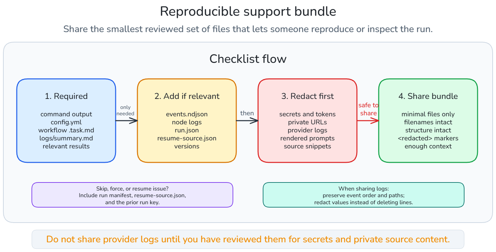

# Reproducible Support Bundle

Collect the smallest bundle that lets another person reproduce or inspect the
run without access to your machine.

Do not share provider logs until you have reviewed them for secrets and private
source content.

Collect only the files needed to reproduce or inspect the issue. Add deeper logs
and manifests only when relevant, redact secrets and private content, and keep
filenames and structure intact when possible.

## Minimal Bundle

- Exact command output from `crewplane validate` or the `crewplane run` command
  used.
- Redacted `.crewplane/config.yml`.
- The workflow `.task.md` file and any imported workflow files.
- `.crewplane/execution-stages/<run-key>/logs/summary.md`.
- Relevant result files from `.crewplane/execution-results/<run-key>/`.

## Full Bundle

Add these when the minimal bundle is not enough:

- `.crewplane/execution-stages/<run-key>/logs/events.ndjson`.
- Relevant node log files from `.crewplane/execution-stages/<run-key>/<node-id>/logs/`.
- `crewplane --version`, Python version, OS, shell, and install method.
- Provider CLI names and versions when the run used the `cli` invoker.

## Quick Reference

| Group | Include |
| --- | --- |
| Required | Command output, redacted `.crewplane/config.yml`, workflow `.task.md` files, imported workflow files, `logs/summary.md`, relevant result files. |
| Only if relevant | `logs/events.ndjson`, node logs, `manifests/run.json`, `resume-source.json`, workspace state, provider CLI versions. |
| Review and redact first | Provider logs, rendered prompts, private source snippets, hostnames, repository URLs, credentials, tokens, and absolute home paths. |
| Environment | Crewplane version, Python version, OS, shell, install method, provider CLI names and versions. |

## Redact

Provider output is outside Crewplane's secret-redaction boundary. Review
`.crewplane/execution-stages/<run-key>/` logs and
`.crewplane/execution-results/<run-key>/` before sharing.

Before sharing, remove or replace:

- API keys, tokens, cookies, and credentials.
- Private repository URLs and hostnames.
- Secrets printed by provider CLIs.
- Proprietary source snippets that are not needed for the failure.
- Absolute home-directory paths when they identify people or machines.

Keep structure and filenames intact when possible. Replacing a secret with
`<redacted>` is better than deleting the whole line because timestamps, event
order, and file paths often explain failures.

## Skip, Force, And Resume Context

When the issue involves skipped or resumed work, include:

- `.crewplane/execution-stages/<run-key>/manifests/run.json`
- any relevant `.crewplane/execution-stages/<run-key>/<node-id>/resume-source.json`
- the prior run key named in the manifest or terminal output, if available

If `crewplane run --force` changes the behavior, include output from both the
run without `--force` and the forced run.

## Next

Continue to [Cleaning Up Workspace Caches](cleanup.md) to remove generated
workspace cache entries after workspace-isolated runs.

Or return to the [Guides](../index.md#guides).
