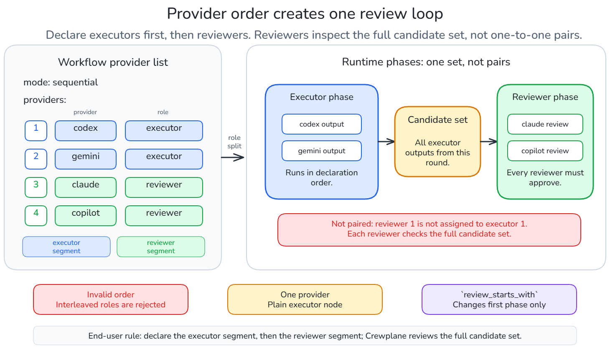
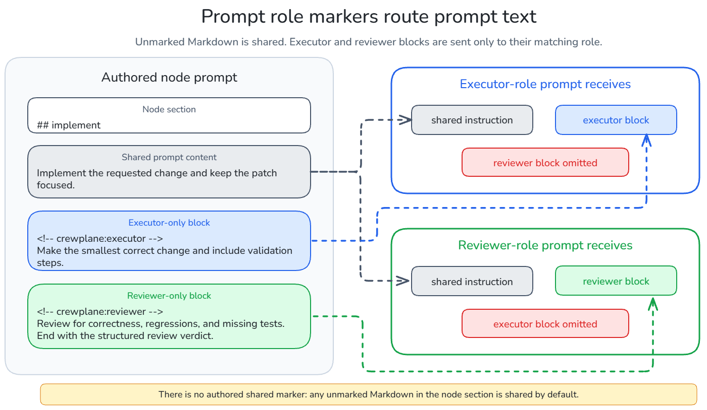
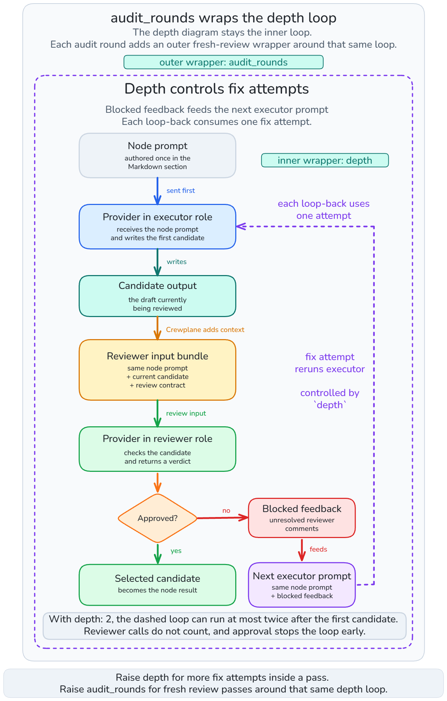

# Review Loops

The node modes guide introduces the review-loop shape: a `sequential` node with
providers in the executor role followed by providers in the reviewer role. This
guide explains what happens after you choose that shape.

In a review loop, providers in the executor role produce a candidate, providers
in the reviewer role approve or block it, and blocked reviews can send feedback
into bounded fix attempts. Start with the smallest loop first, then add controls
only when the workflow needs them.

For separate structured issue artifacts, see
[Findings artifacts](findings.md).

## Smallest Review Loop

A review loop starts with one sequential node, one provider in the executor
role, and one provider in the reviewer role:

```yaml
---
schema_version: "1.0"
name: "Review Loop Example"
nodes:
  - id: implement
    mode: sequential
    providers:
      - provider: codex
        role: executor
      - provider: claude
        role: reviewer
---

## implement
Implement the requested change and list the files changed.
```

This example uses the defaults:

- the provider in the executor role runs first
- providers in the reviewer role run after a candidate exists
- the same authored prompt is used for both roles
- one blocked review can trigger one fix attempt by the provider in the
  executor role
- the loop ends when reviewers approve or the configured attempts are exhausted


A candidate is the output from the provider in the executor role that is
currently being reviewed. In the smallest loop, Crewplane first sends the node
prompt to the provider in the executor role. When that provider writes a
candidate, Crewplane sends the same authored prompt to the provider in the
reviewer role, plus the current candidate and the structured review contract.

If the reviewer blocks the candidate, Crewplane carries the unresolved feedback
into the next fix prompt for the provider in the executor role. Review-loop
status records which executor candidate is canonical. Reviewer output remains
available as review evidence, but it is not a replacement for the executor
candidate.

## Provider Order

Add more providers by keeping the same `sequential` review-loop shape. Put
every provider in the executor role first, then every provider in the reviewer
role:

```yaml
---
schema_version: "1.0"
name: "Provider Order Example"
nodes:
  - id: implement
    mode: sequential
    providers:
      - provider: codex
        role: executor
      - provider: gemini
        role: executor
      - provider: claude
        role: reviewer
      - provider: copilot
        role: reviewer
---

## implement
Implement the requested change and list the files changed.
```

**Provider order is the role contract.** Review loops have one valid provider
shape: a contiguous segment of providers in the executor role followed by a
contiguous segment of providers in the reviewer role.

This order declares roles; it does not create one-to-one pairs. Crewplane does
not treat the first reviewer as the reviewer for the first executor, or the
second reviewer as the reviewer for the second executor. It runs the executor
segment as one executor phase, then runs the reviewer segment as one review
phase.



In this example, `codex` and `gemini` are providers in the executor role.
`claude` and `copilot` are providers in the reviewer role. Each executor round
produces a candidate set. With one executor, that set has one output. With
multiple executors, the set contains one output from each executor in provider
order. Reviewers receive the same current candidate set.

If any executor output in a round is empty, missing, or rejected as an invalid
candidate, Crewplane skips reviewer calls for that round. It does not ask
reviewers to approve a partial candidate set. If reviewers block and another
fix attempt is available, unresolved feedback is carried into the next executor
round for all providers in the executor role.

Use the provider counts to choose the review shape:

Use provider counts to choose how much fanout and review pressure the node needs.
Most review loops should start with one executor. Add more reviewers when the
same candidate needs independent checks. Add more executors only when multiple
executor outputs should remain part of the reviewed candidate set.

- **Multiple executors, one reviewer**: executors run in declaration order and
  produce one candidate set. One reviewer checks the whole set and must approve
  it.
  - **Use this sparingly**, when you want several executor outputs reviewed together,
    such as competing drafts, research passes, or complementary sections. It does
    not choose or merge a winner for you.

- **One executor, multiple reviewers**: one executor produces the candidate.
  Reviewers run in parallel against that same candidate, and every reviewer must
  approve.
  - **This is the usual code-review shape**. Use it when one implementation needs
    multiple independent checks, such as correctness, security, docs, or domain
    review.

- **Multiple executors and multiple reviewers**: executors produce one candidate
  set. Every reviewer checks the same full set, and every reviewer must approve.
  Blocking feedback from any reviewer goes to the next executor round for all
  executors.
  - **Use this only when both sides need fanout**: multiple executor outputs must be
    reviewed together, and approval needs more than one independent reviewer.
    For ordinary implementation review, prefer one executor with multiple
    reviewers.

> ⚠️ **Note:** Do not put a reviewer between providers in the executor role, and do not add another provider in the executor role after a reviewer.

A sequential node with one provider is a plain executor node. A parallel node
never accepts reviewers. If you later use `review_starts_with: reviewer`, keep
the provider list in the same executor-role then reviewer-role order.

## Prompt Roles

Unmarked Markdown is shared prompt content. Providers in the executor role
receive shared content plus `executor` blocks. Providers in the reviewer role
receive shared content plus `reviewer` blocks.

The smallest loop sends the same authored prompt to both roles. Add role blocks
when providers in the two roles need different instructions:

```markdown
## implement
Implement the requested change and keep the patch focused.

<!-- crewplane:executor -->
Make the smallest correct change and include validation steps.
<!-- /crewplane:executor -->

<!-- crewplane:reviewer -->
Review for correctness, regressions, and missing tests.
End with the structured review verdict.
<!-- /crewplane:reviewer -->
```

Authored role markers are only `executor` and `reviewer`; there is no authored
`shared` marker. During review-loop execution, Crewplane also adds the current
executor candidate set, any unresolved previous feedback, reviewer-only safety
instructions, and the review contract to the reviewer prompt.



## Reviewer Verdicts

Reviewers are asked to end with this structured review block:

```markdown
## Major Issues
None

## Minor Issues
None

## Nitpicks
None

---
VERDICT: CHANGES_REQUESTED | NITS_ONLY | NO_FINDINGS
```

`NO_FINDINGS` and `NITS_ONLY` approve the candidate set. `CHANGES_REQUESTED`
blocks it and sends feedback to the next executor fix attempt.

One reviewer and multiple reviewers use the same loop. The difference is the
review phase:

| Reviewer count | Runtime behavior | Approval rule |
| --- | --- | --- |
| One reviewer | One reviewer receives the reviewer prompt and current candidate set. | That reviewer must approve. |
| Multiple reviewers | Reviewers run in parallel against the same current candidate set. | Every reviewer must approve. |

Reviewers do not see each other's current-round feedback before responding.
`settings.max_parallel_invocations` can cap parallel reviewer calls.

If reviewer output is malformed or ambiguous, Crewplane preserves the text as
unstructured feedback and does not count it as approval. Plain-language approval
or blocker cues may be inferred when no structured block is present, but the
structured block is the reliable contract.

## Add Fix Attempts With `depth`

Use `depth` when the executor should get more chances to fix blocked feedback
inside one review pass:

```yaml
nodes:
  - id: implement
    mode: sequential
    providers:
      - provider: codex
        role: executor
      - provider: claude
        role: reviewer
    depth: 2
```

`depth` counts executor fix attempts after the first reviewed candidate. It does
not count the first executor candidate, reviewer calls, or fresh audit passes.


For example, `depth: 2` allows this maximum shape inside one audit round:

```text
Local round 1: executor candidate, then reviewer(s)
Local round 2: if blocked, executor fix attempt 1, then reviewer(s)
Local round 3: if blocked, executor fix attempt 2, then reviewer(s)
```

If all reviewers approve before those attempts are used, the loop stops early.
Only unresolved major issues, minor issues, and unstructured reviewer feedback
are carried into the next executor prompt. Nitpicks stay in the run record
unless a reviewer writes them as major or minor concerns.

## Add Fresh Passes With `audit_rounds`

Use `audit_rounds` when reviewers should get a fresh pass over a candidate
that was approved only after remediation:

```yaml
nodes:
  - id: implement
    mode: sequential
    providers:
      - provider: codex
        role: executor
      - provider: claude
        role: reviewer
    depth: 1
    audit_rounds: 2
```

`audit_rounds` wraps the whole review pass. Each audit round has its own local
`depth` budget. A later audit round reviews the latest valid executor candidate
from the previous audit round.



Use the controls for different reasons:

| Control | Use when | Default |
| --- | --- | --- |
| `depth` | The executor should get more fix attempts for blocked feedback. | `1` |
| `audit_rounds` | The whole review loop should repeat as a fresh pass. | `1` |

Start with `depth: 1` and `audit_rounds: 1`. Raise `depth` first when failures
are usually fixable. Raise `audit_rounds` when you want reviewers to inspect a
fixed candidate again without inherited unresolved feedback from the prior pass.
`audit_rounds` must not exceed `settings.max_audit_rounds`.

## Start With Reviewers

The usual review loop starts with an executor candidate. Use
`review_starts_with: reviewer` when reviewers should inspect context that
already exists before this node writes its own executor output. Common inputs are
upstream outputs, findings artifacts, metadata references, or project files.

For example, use reviewer-first when there is **already something to inspect**:

- you manually changed code and want review before the fix step runs
- you want reviewers to inspect the current branch or selected project files
- a previous node produced findings, such as `{{test.audit.findings}}`

Reviewers can triage that context first and hand only unresolved feedback to the
executor.

```yaml
nodes:
  - id: review.fix
    mode: sequential
    providers:
      - provider: codex
        role: executor
      - provider: claude
        role: reviewer
    review_starts_with: reviewer
```

What changes:

- It changes only the first phase of the review loop.
- It does not change provider order. Keep all executors first, then all
  reviewers.
- It does not replace the executor. The node still finishes with an executor
  output from this node as its final result.
- It does not consume `depth`. The first reviewer pass is recorded as round 0.

What reviewers can inspect:

Round 0 gives reviewers a chance to inspect the context you author before any
same-node executor candidate exists. Include any of these in the prompt:

- shared prompt text
- reviewer-only prompt blocks
- upstream artifacts such as `{{node.output}}` and `{{node.findings}}`
- metadata references such as `{{node.output_sha256}}`
- project files included with `{{file:...}}`

What happens next:

After round 0, local round 1 runs the executor:

- If reviewers approve the existing context, the executor receives preservation
  guidance and writes this node's executor output.
- If reviewers report major issues, minor issues, or unstructured feedback, that
  feedback becomes the executor handoff.
- Reviewers then inspect the executor candidate through the normal review
  contract.

Be explicit about inputs. `needs` controls node ordering, but it does not tell
reviewers what to inspect. Reference the review context in shared prompt text or
reviewer-only prompt blocks:

```markdown
## review.fix
Use these inputs as review context:

- backend: {{backend.impl.output}}
- frontend: {{frontend.impl.output}}
- test findings: {{test.audit.findings}}
- backend digest: {{backend.impl.output_sha256}}
```

For project files, include each file with `{{file:...}}`:

```markdown
## review.local
Use these files as context for the initial review and any required fix:

{{file:src/foo.py}}
{{file:tests/test_foo.py}}
```

## Continue Or Fail On Exhaustion

Reviewer verdicts are part of the loop, not invocation failures.
`CHANGES_REQUESTED` drives remediation while attempts remain.

`continue_on_failure` applies to reviewer invocation failures and review-loop
consensus exhaustion. When a valid candidate exists and continuation is allowed,
Crewplane preserves the run record and completes the node instead of failing the
workflow for exhaustion. Failed dependencies still block downstream nodes.

## What You Can Inspect

Review-loop runs write executor outputs, reviewer outputs, logs, and review
state under the node stage directory. Final results are selected from the
review-loop status file.

The important file is:

```text
<node-id>/review-state/review-loop-status.json
```

It records the selected executor candidate, reviewer verdicts, and exhaustion
state. Crewplane uses that status file to choose the final node result, so
downstream `{{node.output}}` points at the executor result chosen by the review
loop.

## Workspace Notes

When Experimental worktrees are enabled, reviewer invocations inspect the
current executor candidate but do not advance source lineage. Executor and
remediation rounds produce candidate lineage. A mutable `kind: worktree` node
can have only one provider in the executor role; providers in the reviewer role
remain allowed in sequential review loops.

With Experimental managed workspaces, reviewer-first `{{file:...}}` context
uses compiled Git source state: same-node candidate if one already exists,
otherwise upstream lineage for node-sourced worktrees, otherwise project initial
source. It does not add support for uncommitted manual edits inside managed
workspaces.

## Next

Continue to [Findings Artifacts](findings.md) to create
structured issue handoffs for downstream workflow nodes.

Or return to the [Guides](../index.md#guided-tutorial-track).
