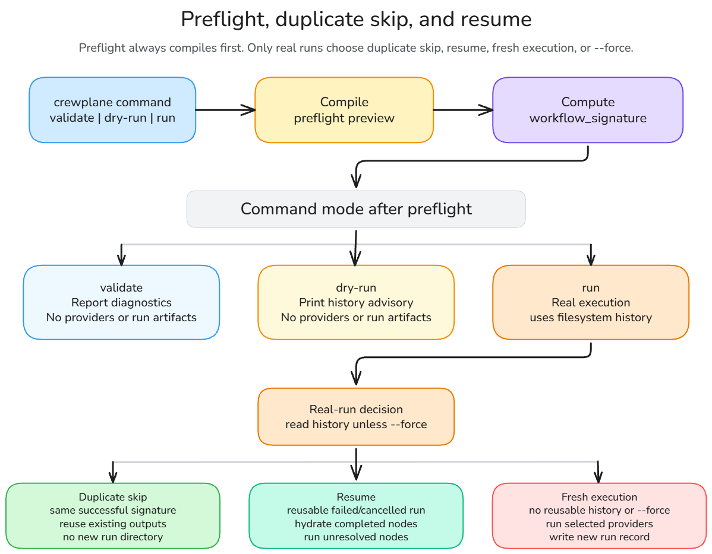

# Running Workflows

Before the commands, the thing you run is a workflow file. A Crewplane
workflow is a `.task.md` Markdown file with YAML frontmatter at the top and one
prompt section for each provider-backed node:

```markdown
---
schema_version: "1.0"
name: "Review Then Summarize"
nodes:
  - id: inspect
    mode: parallel
    providers: ["mock"]
    findings: true
  - id: summarize
    mode: sequential
    providers: ["mock"]
    needs: ["inspect"]
---

## inspect
Review the repository and write the highest-risk findings.

## summarize
Summarize the result from {{inspect.output}} for the final report.
```

The frontmatter declares the DAG: nodes, providers, and dependency edges. The
matching `## <node-id>` sections are the prompts Crewplane sends to the selected
providers.

## Run The Basic Flow

When you are still editing a workflow, run validation as a separate check to
catch workflow, config, provider, and template problems before execution starts.

```bash
crewplane validate
```

Then preview the execution plan:

```bash
crewplane run --dry-run
```

When the plan looks right, run the workflow. `crewplane run` performs preflight
validation before invoking anything. If tmux is available, Crewplane opens the
live dashboard; otherwise it continues and writes the same run records under
`.crewplane/`.

```bash
crewplane run
```

## Preflight Lifecycle

Preflight is how Crewplane knows what it is about to run before provider CLIs
start. It is also the basis for duplicate-skip and safe resume decisions.

`crewplane validate`, `crewplane run --dry-run`, and real `crewplane run`
commands all compile a preflight execution-plan preview before providers are
invoked.

For real execution, the runtime consumes the compiled preflight plan and bundle.
It does not reparse prompt templates or reread original `{{file:...}}` paths.



The lifecycle is:

- Compile the preflight plan.
- Compute the `workflow_signature`.
- For real runs, check filesystem history for a matching success or resumable
  partial run.
- Run providers, skip duplicate work, or hydrate completed node outputs for
  resume.
- Write manifests and results so the decision is inspectable later.

Use `--force` when you want Crewplane to create a new run with a new run ID and
rerun selected nodes instead of using duplicate skip or resume hydration.

## What Preflight Compiles

Preflight resolves the composed workflow into:

- execution order
- execution nodes
- render plans
- static file resources
- workspace source metadata
- workspace file locators
- token catalog entries
- dependency edges
- provider records
- redacted runtime config snapshot
- effective runtime config signature
- value fingerprints
- fingerprint metadata
- `workflow_signature`

Preflight diagnostics are emitted before runtime execution. A failed real-run
preflight writes failure artifacts so the run remains inspectable.

## What Happens On The Second Run

By default, Crewplane may skip a run when it finds an earlier success with the
same tracked inputs. After a failed run, it may reuse completed steps. Use
`crewplane run --force` to run the whole workflow from the beginning once.

## Default Discovery

`crewplane validate` and `crewplane run` look for exactly one top-level
`.task.md` file in `.crewplane/workflows/` when no workflow path is supplied.
Fresh projects contain:

```text
.crewplane/workflows/single-agent-review.task.md
```

Advanced examples are copied under `.crewplane/workflows/example-templates/`.
They are not selected by default.

If there are zero or multiple top-level workflow files, select one explicitly:

```bash
crewplane validate .crewplane/workflows/single-agent-review.task.md
crewplane run --tasks .crewplane/workflows/single-agent-review.task.md
```

## Config Selection

By default, commands use `.crewplane/config.yml`. Override it with:

```bash
crewplane validate --config .crewplane/config.yml
crewplane run --config .crewplane/config.yml
```

## Validate

```bash
crewplane validate [TASKS_FILE] --config .crewplane/config.yml
```

`validate` checks workflow parsing, composition, schema, providers, policies, DAG
shape, template references, and preflight plan compilation. It never starts
provider invocations.

With the built-in `cli` invoker, validation also checks configured provider CLI
availability and points failures to
[provider setup](../getting-started/provider-setup.md). With the
`crewplane init` mock config, it skips provider CLI availability checks because
mock execution will not launch provider CLIs.

## Dry Run

```bash
crewplane run --dry-run --tasks .crewplane/workflows/single-agent-review.task.md
```

Dry-run prints the compiled execution plan and, with the filesystem artifact
backend, an advisory skip/resume decision based on existing manifests. It
invokes no providers, writes no run artifacts, and skips provider CLI
availability checks.

Expected advisory phrases include:

- `Resume advisory: would_execute_full_run`
- `Resume advisory: would_skip`
- `Resume advisory: would_resume <n> node(s) from <run-id> (nodes: <ids>)`,
  which reports the exact dependency-closed node identifiers selected for
  hydration

## Run The Workflow

```bash
crewplane run
crewplane run --tasks .crewplane/workflows/single-agent-review.task.md
```

A non-dry run writes preflight/run artifacts, invokes the configured invoker,
records logs and manifests, and writes consolidated results.

Use:

- `--tasks` or `-t` to select a workflow.
- `--config` or `-c` to select config.
- `--force` to bypass same-signature skip and failed/cancelled-run resume.
- `--no-live` when you want a plain terminal run without the live dashboard.

Open [Inspecting Run Records](inspecting-artifacts.md) after a run to see the
summary, event timeline, manifests, stage outputs, and results.

## Command Reference

| Command | What it does |
| --- | --- |
| `crewplane validate` | Compiles and checks the selected workflow without invoking providers or writing run artifacts. |
| `crewplane run --dry-run` | Prints the compiled execution plan and skip/resume advisory without invoking providers or writing run artifacts. |
| `crewplane run` | Runs the selected workflow, writes run artifacts, and opens the live dashboard when tmux is available. |
| `crewplane run --no-live` | Runs the selected workflow with plain terminal output instead of the live dashboard. |
| `crewplane run --tasks <file>` | Runs the workflow file you name instead of relying on default discovery. |
| `crewplane run --force` | Creates a new run with a new run ID, reruns selected nodes, and bypasses duplicate-skip and resume hydration. |

## Workflow IDs, Run IDs, And Run Keys

Crewplane records a workflow ID, a run ID, and a run key:

- The **workflow ID** identifies the workflow in artifact paths. Example:
  `single-agent-review--5e34bc54c79a`.
- The **run ID** is the per-attempt ID stored in manifests and printed by some
  resume messages. Example: `20260629-202539`.
- The **run key** is the filesystem directory name under
  `.crewplane/execution-stages/` and `.crewplane/execution-results/`. Example:
  `single-agent-review--5e34bc54c79a-20260629-202539`.
- The run key combines the workflow ID and run ID. Use the full run key anywhere
  these docs show `<run-key>`.

## Workflow Signature

Duplicate detection uses `workflow_signature`. The signature includes the
composed workflow, referenced workflow files, dependency graph, static file
content hashes, workspace file locator facts, relevant env/var/config
fingerprints, provider execution settings, artifact-scoped integration options,
and execution policy.

Observer-only UI settings do not determine the workflow signature. Branch-export
fields are intentionally excluded because they affect how verified workspace
results are exposed, not what providers run. The default workspace cache root is
excluded unless `settings.workspace.identity.include_cache_root` is `true`.
Presentation-only `log_level` is also excluded. Review-loop ceilings and
consensus policy participate only when the compiled plan contains a sequential
reviewer loop.

## Duplicate Skip

With the built-in filesystem artifact backend, a successful previous run with
the same workflow identity and `workflow_signature` can make a later real run
skip instead of invoking providers again.

Evidence lives under:

- `.crewplane/execution-stages/<run-key>/manifests/run.json`, for example
  `.crewplane/execution-stages/single-agent-review--5e34bc54c79a-20260629-202539/manifests/run.json`
- `.crewplane/execution-results/<run-key>/`, for example
  `.crewplane/execution-results/single-agent-review--5e34bc54c79a-20260629-202539/`

The terminal phrase `Identical context detected` means Crewplane found a usable
same-signature successful run. The message names the prior run ID when
available; the matching artifact directory uses the full run key. It also
suggests `--force` when you want Crewplane to create a new run with a new run ID
and rerun the workflow.

Use `crewplane run --dry-run` to preview the advisory decision. Use `--force`
when you intentionally want to bypass both duplicate skip and resume hydration.
Crewplane creates a new run ID and reruns the selected nodes.

## Resume

When no valid same-context success exists, a failed or cancelled
filesystem-backed run can resume at completed node boundaries. Validated
completed nodes are reused, while incomplete nodes restart from the beginning.

`run --dry-run` only prints a resume advisory. It does not write run artifacts or
bind future execution to that advisory.

Look for:

- `resumed_nodes` in `.crewplane/execution-stages/<run-key>/manifests/run.json`
- `resume_source_run_id` and `resume_source_run_key_name` in the run manifest
  when resume hydration happened
- `<node-id>/resume-source.json` in resumed node stage directories
- hydrated result files under `.crewplane/execution-results/<run-key>/`

Use `--force` to bypass resume hydration and rerun every selected node.

## Decision Table

| When | What happens | What to run instead |
| --- | --- | --- |
| The same workflow already finished successfully with the same inputs and settings. | Crewplane reuses the saved result and does not invoke providers. | Run `crewplane run --force` to create a new run with a new run ID and rerun selected nodes. |
| A previous run failed or was cancelled after some nodes finished. | Crewplane creates a new run, reuses validated completed node outputs, and reruns incomplete nodes from the beginning. | Run `crewplane run --force` to create a new run with a new run ID and rerun every selected node. |
| You run `crewplane run --dry-run`. | Crewplane prints the plan and skip/resume advisory only. It does not invoke providers or write run artifacts. | Run `crewplane run` to execute. |
| Provider settings, workflow files, templates, or referenced inputs changed. | Crewplane computes a different workflow signature, so older results for different inputs or settings are not reused as duplicates. | Usually no override is needed. Run `crewplane run --dry-run` to preview the decision; use `crewplane run --force` only to bypass matching history for the new signature. |

## How To Tell What Happened

Use these files first:

- `.crewplane/execution-stages/<run-key>/manifests/run.json`
- `.crewplane/execution-stages/<run-key>/logs/summary.md`
- `.crewplane/execution-stages/<run-key>/logs/events.ndjson`
- `.crewplane/execution-results/<run-key>/`

Fields and evidence to inspect:

- `workflow_signature` identifies the compiled context used for skip/resume.
- `resumed_nodes` records nodes hydrated from a prior failed or cancelled run.
- `resume_source_run_id` and `resume_source_run_key_name` point at the prior run
  when resume hydration happened.
- `<node-id>/resume-source.json` appears inside resumed node stage directories.
- The terminal phrase `Identical context detected` means a same-signature
  successful run was reused.

## Run a Workflow More Than Once

Suppose a cleanup workflow should inspect the project again after making
edits. Without a repeat setting, if it has not run before and the first run
succeeds, you could run it twice like this:

```bash
crewplane run          # First run
crewplane run --force  # Run the whole workflow again
```

To do both runs with one command, add `repeat_force_run_count: 2` to the
workflow:

```markdown
---
schema_version: "1.0"
name: "Cleanup Workflow Example"
repeat_force_run_count: 2
nodes:
  - id: cleanup_example
    mode: sequential
    providers: ["codex"]
---

## cleanup_example
Inspect the current project and fix worthwhile cleanup candidates.
If nothing needs cleanup, report that result successfully.
```

Replace `codex` with a provider configured in `.crewplane/config.yml`.
Repeated runs require `settings.workspace.enabled: false` and no `worktrees`
declarations in this workflow or its imports, even if unused.

With this setting, one command performs both runs:

```bash
crewplane run
```

Crewplane applies `--force` to **both** runs, including the first. It runs even
if an earlier success could otherwise be reused. Adding `--force` to the
command does not increase the count.

Each run keeps the behavior of an ordinary `crewplane run --force`:

- Crewplane validates and runs the whole workflow from the beginning, without
  skipping an earlier success or resuming a failed run.
- It uses the current project files, including edits left by earlier runs.
  Before the next run, Crewplane reloads the workflow, its imports, and config.
- Each successful run has its own run ID and saved results. Crewplane finishes
  cleanup and releases its run lock before starting the next run.
- A successful run continues to the next, even if there is nothing to clean.
  A failed or cancelled run stops the remaining runs. Earlier results and
  project edits remain.

Crewplane reads the count when the command starts, so editing or removing it
does not change this command's total or workspace requirement. A new command
reads the count again. `--dry-run` previews only the first run and reports the
planned total; validation and dry-run do not start providers or write run
artifacts.

> [!TIP]
> This is a convenient way to run a workflow repeatedly, especially for cases like code audits, cleanup, and refactoring.

## Advanced: Artifact Backend

The built-in filesystem artifact backend is the supported backend for normal
non-dry runs. A custom artifact backend must implement the same port capabilities
for locks, skip/resume history, full-run output, and workspace lineage before it
can replace it.

## Next

Continue to [Watch Runs Live and Inspect Results](watch-runs-live-and-inspect-results.md)
to understand what you can watch while a workflow runs.

Or return to the [Guides](../index.md#guided-tutorial-track).
