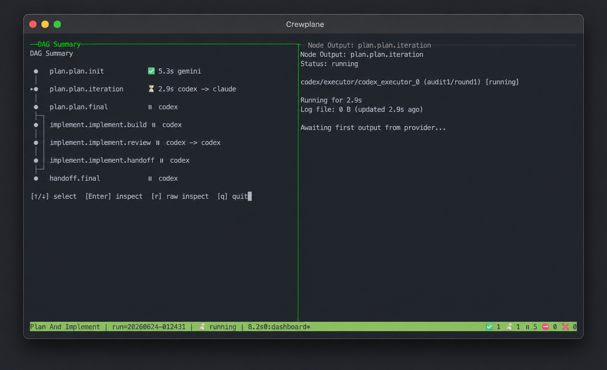

# Watch Runs Live and Inspect Results

Every `crewplane run` writes readable records under `.crewplane/`: run events,
summaries, final results, and provider logs when a provider CLI is started. When
you run Crewplane interactively, you can also watch progress in the tmux
dashboard while those records are being written.

## Watch a Run Live

For normal interactive runs, Crewplane opens the tmux dashboard automatically
when:

- `tmux` is installed.
- Provider CLI output logs are enabled, which is the default for filesystem
  artifacts.
- You have not passed `--no-live`.

If the dashboard cannot open, Crewplane warns and continues with normal terminal
output. CI and other non-interactive runs skip the dashboard automatically.

To run without the dashboard yourself, use:

```bash
crewplane run --no-live
```

## Read the Dashboard

[](../../.github/crewplane-splash.png)

The dashboard has two panes:

- The left pane shows the workflow's nodes as a live dependency view. It marks the
  selected node and shows which nodes are waiting, running, finished, failed, or
  blocked by an earlier failure.
- The right pane follows the selected node. It shows the node status, provider
  details, and recent provider log output. If the selected node has not started
  yet, the pane shows why it is waiting.

## Dashboard Controls

Use these keyboard keys while the dashboard is open:

| Keyboard key | Action |
| --- | --- |
| `Up` / `Down` | Select a different node in the left pane. |
| `Enter` | Open the selected node's log in the right pane, if one is available. |
| `r` | Open the raw saved log for the selected node. |
| `f` | Switch to formatted log view while inspecting a log. |
| `PageUp` / `PageDown` or mouse wheel | Scroll while inspecting a log. |
| `Escape` | Return from log inspection to the live dashboard. |
| `q` | Quit the dashboard and cancel the running workflow. |

While you inspect a log, the right pane stays on that log until you press
`Escape`. The left pane keeps showing the live node view.

## Find Saved Run Records

The files under `.crewplane/` are the source of truth after a run. The dashboard
is only a live view on top of those same records.

| Need | Where to look |
| --- | --- |
| Live workflow status | tmux dashboard while the run is active. |
| Run summary | `.crewplane/execution-stages/<run-key>/logs/summary.md`. |
| Event timeline | `.crewplane/execution-stages/<run-key>/logs/events.ndjson`. |
| Provider output | Each node's stage directory under `.crewplane/execution-stages/<run-key>/`. |
| Final results | `.crewplane/execution-results/<run-key>/`. |

Start with the run summary. It includes run status and visible-text usage/spend
estimates when the provider output contains enough information or pricing is
configured.

## Troubleshooting

| What you see | What it means | What to do |
| --- | --- | --- |
| The dashboard does not open. | `tmux` may be missing, the run may be non-interactive, or live mode may be disabled. | Install `tmux`, run in a terminal, and avoid `--no-live`. |
| Crewplane says `log_cli_output=true` is required. | Provider CLI output logs are disabled. | Enable `log_cli_output` in the filesystem artifact options. |
| Crewplane continues with plain terminal output. | Live dashboard startup failed or was skipped. | The run can still complete; inspect the saved run records afterward. |

Provider CLI output logs are enabled by default for the filesystem artifact
backend. If you need to turn them back on, use:

```yaml
settings:
  integrations:
    artifacts:
      implementation: "filesystem"
      options:
        log_cli_output: true
```

## Optional Dashboard Settings

Changing dashboard settings only affects what you see while the run is active.
It does not change the run records saved under `.crewplane/`.

The defaults usually work. If you want to tune how the dashboard behaves, set the
tmux UI options in `.crewplane/config.yml`:

```yaml
settings:
  integrations:
    ui:
      implementation: "tmux"
      options:
        auto_close_session: true
        tmux_executable: "tmux"
        quiet_after_seconds: 120.0
        log_tail_lines: null
```

The options mean:

- `auto_close_session` closes the tmux session when the run finishes. Set it to
  `false` if you want the final dashboard to stay open.
- `tmux_executable` is the command Crewplane uses to start tmux. Change it if
  tmux is installed under a different name or path.
- `quiet_after_seconds` controls when the right pane shows a "no new output"
  notice for a running provider. It does not stop the provider; it only tells you
  the process is still running but has not written to its log recently.
- `log_tail_lines` controls how many recent log lines appear in the right pane.
  Leave it as `null` to let Crewplane fit the log tail to the pane height.

## Next

Continue to [Inspecting Run Records](inspecting-artifacts.md) to inspect saved
run records in more detail.

Or return to the [Guides](../index.md#guided-tutorial-track).
