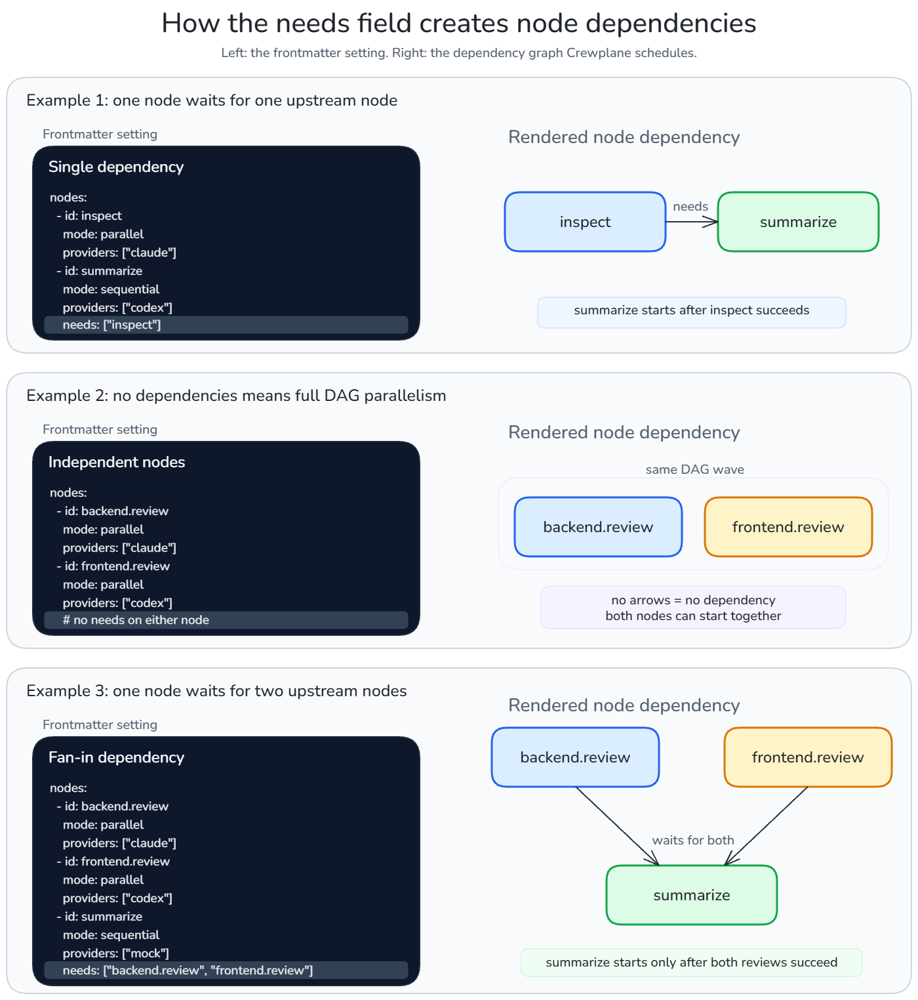

# Workflow Authoring

A Crewplane workflow is a Markdown file with YAML frontmatter at the top and one
prompt section for each provider-backed node. The frontmatter describes the DAG;
the Markdown sections hold the prompts providers will receive.

YAML workflow files can be loaded directly, but imports and composition are
Markdown-only.

## Minimum Workflow

```yaml
---
schema_version: "1.0"
name: "Review"
nodes:
  - id: review.project
    mode: parallel
    providers: ["mock"]
---

## review.project
Review the current repository and summarize the highest-risk issues.
```

This is one node in one DAG. The provider name must match an `agents` entry in
`.crewplane/config.yml`.

## Annotated Workflow

```yaml
---                         # frontmatter starts
schema_version: "1.0"       # must match the current Crewplane schema
name: "Review"              # workflow name
nodes:                      # DAG node declarations
  - id: review.project      # node ID and Markdown section name
    mode: parallel          # execution pattern inside this node
    providers: ["mock"]     # agent names from .crewplane/config.yml
---                         # frontmatter ends

## review.project           # prompt section for the node
Review the current repository and summarize the highest-risk issues.
```

The YAML frontmatter declares what Crewplane will run. The Markdown section is
the prompt body for the matching non-input node.

## Multi-Provider Example

```yaml
---
schema_version: "1.0"
name: "Review"
description: "Review the repository"
nodes:
  - id: review.context
    mode: parallel
    providers: ["claude", "codex"]
---

## review.context
Review the current repository and report high-risk issues.
```

## Core Terms

| Term | Meaning |
| --- | --- |
| Workflow | The whole DAG. |
| Node | One unit of work in the DAG. |
| Provider | A name listed in `providers` for a node. |
| `needs` | Dependency edge from one node to another. |
| Artifact reference | A template such as `{{node.output}}` or `{{node.findings}}` that lets downstream nodes read upstream results. |

## Frontmatter

Frontmatter declares workflow metadata, optional inputs and imports, optional
experimental worktree settings, and executable nodes. The generated templates
use the current schema version from `src/crewplane/version.py`.

Node IDs use lower-case letters, digits, `.`, `_`, and `-`. They cannot be `.`,
`..`, `logs`, `manifests`, or `workspace-exports`. A non-input node must have
exactly one `## <node-id>` Markdown section. An input node has no authored body
section and uses `source` instead.

## Dependencies

Use `needs` to declare upstream dependencies:

```yaml
nodes:
  - id: inspect
    mode: parallel
    providers: ["claude"]
  - id: summarize
    mode: sequential
    providers: ["codex"]
    needs: ["inspect"]
```

Downstream prompts can reference upstream artifacts, for example
`{{inspect.output}}` or `{{inspect.findings}}`.



## Node Modes

Every workflow node has a `mode`:

| Mode | Meaning |
| --- | --- |
| `input` | Load one file artifact without invoking a provider. |
| `parallel` | Send the same executor prompt to one or more providers concurrently and aggregate their outputs. |
| `sequential` | Run one executor in order, or run an executor/reviewer review loop when multiple providers are configured. |

`mode: parallel` is provider fanout inside one node. It is different from DAG
concurrency, where independent nodes can run at the same time after their
dependencies are satisfied.


> **NOTE**: `needs` controls DAG order across nodes. `mode: parallel` controls provider
fanout inside one node. A workflow can use both at the same time, but they answer
different questions.

`mode: sequential` has two shapes. With one provider, it is a plain executor
node; `depth` is the total number of executor rounds. With multiple providers,
it is a review loop; providers must be declared as executor providers followed
by reviewer providers.

## Providers

Providers can be shorthand strings or objects:

```yaml
providers:
  - claude
  - provider: codex
    model: gpt-5.5
    role: reviewer
```

**Roles** are `executor` and `reviewer`. Parallel nodes only allow executor roles.
Sequential review loops use executor providers followed by reviewer providers.
Reviewers approve with `NO_FINDINGS` or `NITS_ONLY`; all reviewers must approve
for consensus. For the detailed review-loop contract, continue with the guides
below.

For examples and configuration guidance, see
[Node modes and provider roles](node-modes.md),
[Findings artifacts](findings.md), and
[Review loops](review-loops.md).

Related provider setup terms:

| Term | Meaning |
| --- | --- |
| Config | `.crewplane/config.yml`, the project-local file that defines agents and integrations. |
| Agent | A named config entry that points to a provider command. |
| Provider kind | Adapter hint such as `codex`, `claude`, or `generic`; it affects CLI planning and parsing, not installation or authentication. |
| Invoker | The integration that runs deterministic `mock` calls or real external `cli` process calls. |

## Templates

Supported runtime template forms are:

- `{{file:path}}`
- `{{env:KEY}}`
- `{{var:KEY}}`
- `{{node.output}}`
- `{{node.findings}}`
- `{{node.output_path}}`
- `{{node.findings_path}}`
- `{{node.output_size}}`
- `{{node.findings_size}}`
- `{{node.output_sha256}}`
- `{{node.findings_sha256}}`

`{{file:path}}` references read UTF-8 text and are bounded to the project root by
default. External files must be explicitly allowlisted through
`settings.integrations.artifacts.options.allowed_template_paths`. Symlinks are
resolved before the final access check.

`{{param:key}}` is composition-time only. Bound parameters are substituted
during Markdown workflow composition; unbound parameters are rewritten to
`{{var:key}}` for runtime variable resolution.

See the [workflow syntax reference](../reference/workflow-syntax.md) for the
complete authoring contract.

## Runtime And Output Terms

These terms appear after you validate or run a workflow:

| Term | Meaning |
| --- | --- |
| Preflight | The compiled plan Crewplane validates before provider CLIs run. |
| Stage directory | `.crewplane/execution-stages/<run-key>/<node-id>/`, where node-local logs and artifacts can appear. |
| Result directory | `.crewplane/execution-results/<run-key>/`, where consolidated outputs and findings appear. |
| Findings | Optional structured issue output written when a node declares `findings: true`. |
| Workflow signature | The preflight-derived identity Crewplane uses for duplicate skip and resume decisions. |

## Next

Continue to [Node Modes And Provider Roles](node-modes.md) to choose how each
node runs providers and combines their outputs.

Or return to the [Guides](../index.md#guides).
