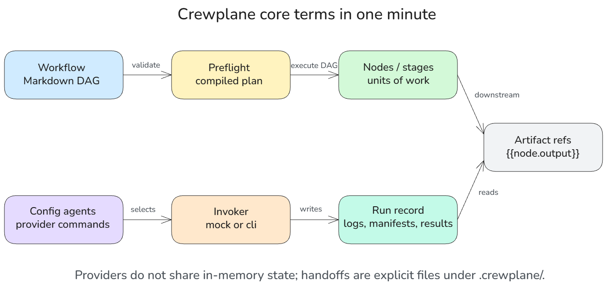

# Crewplane Documentation

Crewplane turns coding-agent CLI calls into explicit, resumable workflows with
local run records on disk.

## Start By Goal

| Goal | Start here |
| --- | --- |
| Understand what Crewplane is | [Why Crewplane?](getting-started/why-crewplane.md) |
| Try it safely without real agent calls | [Installation](getting-started/installation.md), then [Quickstart](getting-started/quickstart.md) |
| Prepare a real provider | [Quickstart](getting-started/quickstart.md), then [Provider setup](getting-started/provider-setup.md) |
| Follow the guided tutorial track | [Running workflows](guides/running-workflows.md) |
| Look up exact syntax and config | [Workflow syntax](reference/workflow-syntax.md), [Configuration](reference/configuration.md), [Commands](reference/commands.md) |

## First Project Path

For a first project, keep this order:

1. Install Crewplane.
2. Run `crewplane init`.
3. Run `crewplane validate`.
4. Run `crewplane run` with the generated mock invoker.
5. Inspect the run record.
6. Run `crewplane onboarding` when you are ready to prepare one real provider.

For details, follow the Getting Started pages in order before moving into the guide track:

1. [Why Crewplane?](getting-started/why-crewplane.md)
2. [Installation](getting-started/installation.md)
3. [Quickstart](getting-started/quickstart.md)
4. [Provider setup](getting-started/provider-setup.md)
5. Continue to [Running workflows](guides/running-workflows.md).

## Guided Tutorial Track

These guides are written to be read in order. Each page ends with a `Next`
section that continues the tour.

1. [Running workflows](guides/running-workflows.md)
2. [Watch Runs Live and Inspect Results](guides/watch-runs-live-and-inspect-results.md)
3. [Inspecting Run Records](guides/inspecting-artifacts.md)
4. [Workflow authoring](guides/workflow-authoring.md)
5. [Node modes and provider roles](guides/node-modes.md)
6. [Review loops](guides/review-loops.md)
7. [Findings artifacts](guides/findings.md)
8. [Workflow composition](guides/workflow-composition.md)
9. Optional: [Experimental workspace isolation](guides/workspace-isolation.md)
   can be omitted unless you need isolated source-tree edits.
10. [Mock validation](guides/mock-validation.md)
11. [Troubleshooting](guides/troubleshooting.md)
12. [Reproducible support bundle](guides/reproducible-support-bundle.md)
13. [Cleanup](guides/cleanup.md)

### Jump In By Task

Feel free to jump around based on what you need right now:

- Run a workflow: [Running workflows](guides/running-workflows.md)
- Inspect outputs: [Inspecting Run Records](guides/inspecting-artifacts.md)
- Write workflows: [Workflow authoring](guides/workflow-authoring.md)
- Configure provider roles and reviews: [Node modes and provider roles](guides/node-modes.md), [Review loops](guides/review-loops.md), [Findings artifacts](guides/findings.md)
- Reuse workflows or isolate file edits: [Workflow composition](guides/workflow-composition.md), [Experimental workspace isolation](guides/workspace-isolation.md)
- Debug or share a run: [Troubleshooting](guides/troubleshooting.md), [Reproducible support bundle](guides/reproducible-support-bundle.md)
- Clean generated state: [Cleanup](guides/cleanup.md)

## Examples

- [Example templates](examples/index.md)
- [Composition examples](examples/composition.md)
- [Experimental workspace examples](examples/workspace.md)

## Reference

- [Commands](reference/commands.md)
- [Configuration](reference/configuration.md)
- [Workflow syntax](reference/workflow-syntax.md)
- [Integrations](reference/integrations.md)
- [Artifacts](reference/artifacts.md)
